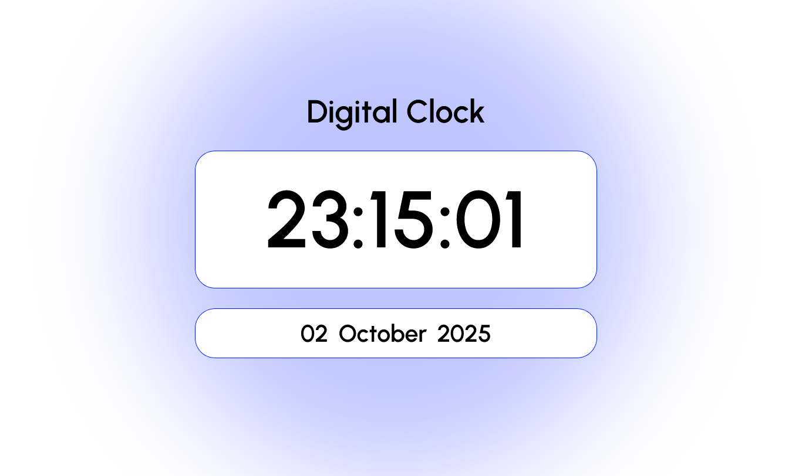

# ⏰ Modern Digital Clock

## ✨ Project Overview

The **Modern Digital Clock** is a sleek, standalone web application that displays the current local time and date in real-time. Designed with a clean, minimalist aesthetic, this project serves as a showcase of competence in front-end development using vanilla JavaScript for real-time DOM manipulation.

The design is centered around clarity and ease of reading, featuring responsive layouts and a distinctive background effect.

---

## 🖼️ Project Preview


---

## 🚀 Features

* **Real-time Clock:** Displays the current time in $\text{HH:MM:SS}$ format, updating every second.
* **Date Display:** Shows the current day, full month name, and year (e.g., $\text{05 October 2025}$).
* **Minimalist Design:** Features a clean, modern aesthetic with a custom font and a subtle, glowing background effect.
* **Responsive Layout:** Fully optimized to look great and function seamlessly across various screen sizes (desktop, tablet, and mobile).

---

## 🛠️ Tech Stack

This project was built using the core technologies of the web:

| Category | Technology | Purpose |
| :--- | :--- | :--- |
| **Structure** | $\text{HTML5}$ | Defines the structure and content of the clock. |
| **Styling** | $\text{CSS3}$ | Styles the application for a modern look, using Flexbox for layout and `clamp()` for responsiveness. |
| **Functionality** | **Pure JavaScript (ES6+)** | Handles fetching the current time and date, and updating the $\text{DOM}$ every second. |

### Libraries & Assets

* **Google Fonts:** Used for the 'Urbanist' typeface to ensure clear and modern typography.

---

## ⚙️ Installation and Usage

To run this project locally, follow these simple steps:

1.  **Clone the Repository:**
    ```bash
    git clone [https://github.com/arcchetan/Digital-clock]
    ```

2.  **Navigate to the Project Directory:**
    ```bash
    cd digital-clock
    ```

3.  **Open the File:**
    Simply open the `index.html` file in your preferred web browser. The clock will start displaying the current local time immediately.

---

## 🤝 Contributing

While this is a completed project, suggestions for improvement or bug reports are always welcome! Feel free to open an issue or submit a pull request.

---

## 👤 Author

**[Chetan Sharma - @arcchetan]**